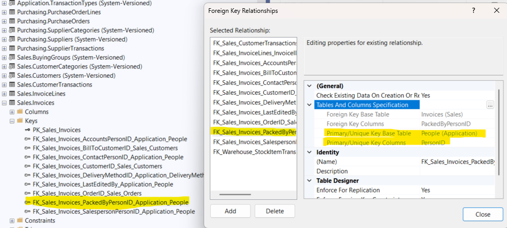

Determining foreign keys i.e. where do they actually come from AND the relationship is somewhat simple. 
Getting an idea of which table they refer to involves the following basic steps
  - Right-click on Keys.
  - Conventionally, primary key names start with 'PK_' and foreign keys start with 'FK_'. However that is just a convention. 
  - Clicking on Modify for a **Foreign Key** brings up the "Foreign Key Relationships" window IF IT IS A FOREIGN KEY. If not, this window will not show up, you will just be seeing the column data. Again, I am just stating this to note that the naming is just a convention. 
  - For a foreign key, the table from which the key value is sourced can be determined using the "Primary/Unique Key Base Table" and "Primary/Unique Key Base Column" fields as shown in the screenshot.

  